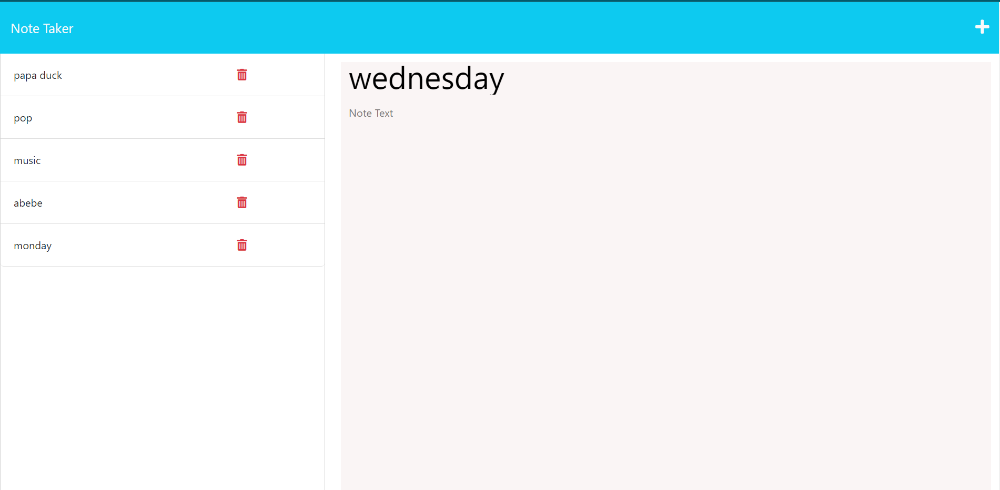

# Express.js Challenge: Note Taker

# Description:

The challenge is to create an application called Note Taker that can be used to write and save notes. This application will use an Express.js back end and will save and retrieve note data from a JSON file.

The application’s front end has already been created. It's your job to build the back end, connect the two, and then deploy the entire application to Heroku. 

# Usage:

Simply click on the plus Icon to add a title and description of the note and then save after clicking the save icon which is beside the plus icon. the save icon comes after you enter some texts on the description.

# Technology Used:

* HTML
* CSS
* JavaScript
* Node js
* Express Js

# Installation

first of all you need to have Node invironment in your local machine to run javascript file

step 1 : clone my repository to your local machine

step 2 :  open in terminal if you are in mac or linux operating system or in command prompt if you are in window

step 3 : type this command  ( cd note-taker-application-expres  ) to navigate to the project

step 4 : type this command ( code .) this helps to open in VS code

step 5 : when you are in VS code click the terminal tab from the VS code to open a terminal from VS code

step 6 : then type git status or git branch and make sure you are on the main branch

step 7 : install express js using (npm i express)

step 8 : and then open terminal and run the command (node server.js) to run the server

step 9 : you will see a text like this (API server now on port :3000!)

step 10: finally open one of your favorite browsers and visit the url (http://localhost:3000/)

step 11 : click (Get Started ) button

step 12: click add icon to add a note and save 

that's it !

# Screenshots!

# Heroku website url screenshot

**Done!  congratulations**

# License

you can clone and use this code for your own task

Access application here :  https://note-taker-application-expres.herokuapp.com/notes

